# Sea Battle Game
Our project is a unique online game that lets you dive into action-packed battles between sailing ships and steamboats. It was built to give a fresh take on the classic Battleship game, enhanced with new and interesting features.

Our game includes:
- unique gameplay
- a large arsenal of weapons
- amazing sprites
- an elegant soundtrack of legendary 20th-century tracks
- stunning graphics
- clever achievements and rewards

## 👤 Our team

Tymofii - Teamlead + Coder in a team of 4. 
Egor - Coder
Ivan - Coder + Designer
Ratmir - Coder

## 🛠 Tech stack

Python · Pygame · raw TCP sockets · threading · JSON · Pillow

## 🎮 Demo


---

### TABLE OF CONTENTS

- [How to use it on Windows](#how-to-use-it-on-windows)

- [How to use it on Linux or MAC](#how-to-use-it-on-linux-or-mac)

- [Our project structure](#our-project-structure)

- [Information about our team](#information-about-our-team)


- [Technologies and languages we used](#technologies-and-languages-we-used)

- [Modules used](#modules-used)

- [Game functionality](#game-functionality)

- [Armory functionality](#armory-functionality)

- [Credits](#credits)


# How to use it on Windows:
1. Open git bash

2. git clone https://github.com/TymofiiZelenyi/Sea_battle_game.git

2. python -m venv venv

3. venv/Scripts/activate

4. Select your activated virtual environment
 
5. pip install -r requirements.txt

6. Launch main.py 

- [BACK](#table-of-contents)
# How to use it on Linux or MAC:
1. Open bash

2. git clone https://github.com/TymofiiZelenyi/Sea_battle_game.git

2. python3 -m venv venv

3. venv/Bin/activate

4. Select your activated virtual environment
 
5. pip install -r requirements.txt

6. Launch main.py 

- [BACK](#table-of-contents)
---

# Our project structure

```mermaid
graph TD
    A[Sea-Battle-Game] --> B[fonts] --> 1(just an archive with the fonts we use)
    A[Sea-Battle-Game] --> C[image] --> 2(just an archive with the images we use)
    A[Sea-Battle-Game] --> D[Modules] --> E[game]
   
    D[Modules] --> F[server.py]
    
    E[game] --> 7(mechanics and different windows)
    E[game] --> I[armory.py] --> 8(contains all info about our special powers such as price, name, radius...)
    E[game] --> J[battle.py] --> 9(contains all mechanics that work only when you battle your opponent)
    E[game] --> K[map.py] --> 10(saves your ship-placement variant; cannot be saved more than once!)
    E[game] --> L[menu.py] --> 11(contains the screen you see when entering the game)
    E[game] --> M[placement.py] --> 12(contains the screen where you place your ships)
    E[game] --> N[wait_opponent.py] --> 13(contains the screen where you can choose join or create_server)
    E[game] --> S[settings_real.py] --> 30(contains the settings window. You can get there by clicking the settings button in the menu. You can also change bg music, cursor and volume)
    E[game] --> O[basement]
    O[basement] --> 14[bg_music.py] --> 22(contains the function that plays background music; you can choose)
    O[basement] --> 15[button.py] --> 23(contains two classes: Text, which can create text, and Button, which creates a pressable button)
    O[basement] --> 16[read_json.py] --> 24(contains a simple function that reads JSON and returns a dict)
    O[basement] --> 17[screen.py] --> 25(contains the screen object)
    O[basement] --> 18[ships.py] --> 26(contains the big Ships class that creates ships!)
    O[basement] --> 19[skills.py] --> 27(contains the Skills class that creates skills)
    O[basement] --> 20[write_json.py] --> 28(contains a simple function that writes data to JSON)
    E[game] --> 31[settings.json] --> 32(contains all of our global settings)
    
    A[Sea-Battle-Game] --> H[sound] --> 5(contains sounds)
    A[Sea-Battle-Game] --> 35[requirements.txt] --> 36(you need to install all of these modules to be able to play this game)


```


---

# Information about our team

1. Github - [Tymofii](https://github.com/TymofiiZelenyi)
2. Github - [Egor](https://github.com/Egor1586)
3. Github - [Ivan](https://github.com/IvanovIvaan)
4. Github - [Ratmir](https://github.com/ratmir-svg)

- [BACK](#table-of-contents)
# Technologies and languages we used
1. >Python - We used Python for rapid development of our game.
2. >Figma - We used Figma to design our game.   


- [BACK](#table-of-contents)
# Figma of the project

- [Figma](https://www.figma.com/design/joBvMYOgpufLtGiCqvJnJt/Untitled?node-id=0-1&t=JThopTyiUqR1RWHE-1)
- [Figjam](https://www.figma.com/board/tlhJvV4adRfLPIy0UZ9NUE/Untitled?node-id=1-5&t=6B7FpF1CBX8vuU7X-1)

- [BACK](#table-of-contents)
# Modules used

- pygame — a Python library for game development. It provides easy-to-use interfaces for managing graphics, sound, and events, making it simple to build interactive applications and games.
- socket — a module that provides access to networking interfaces. It is used to create network connections (e.g., client-server) and allows data to be sent over the network using various protocols such as TCP and UDP.
- io — a module that provides tools for working with input/output streams. It supports different stream types, including text and binary streams, which makes it useful for file handling and data I/O.
- os — a module that provides functions for interacting with the operating system. It allows tasks such as working with the file system, managing processes, and retrieving information about the runtime environment.
- pillow — an image-processing library for Python. It supports many image formats and provides functions to process them, including resizing, cropping, overlaying text, and applying filters.
- Threads — a module that supports multithreading, allowing multiple operations to run simultaneously within a single process. It is useful for tasks that can run in parallel, such as loading data or handling user actions.

- [BACK](#table-of-contents)

# Game functionality:
- [BACK](#table-of-contents)
When the program opens, the main "MENU" window appears, where the user can choose between the following buttons:
- [PLAY](#button-play)
- [ARMORY](#armory-functionality)
- [SETTINGS](#button-settings)
- [QUIT](#button-quit)


# button play
The "PLAY" button:
- By pressing this button, the player moves to the next stage of the game — the ship placement window.

```python
    class Ships():
        def __init__ (self, x: int, y: int, count_length: int, id : int):
            self.x = x
            self.y = y
            self.start_x = x
            self.start_y = y
            
            self.count_length = count_length
            self.ID = id
            self.COLOR = '#E7C500'

            self.WHERE = False

            self.row = 0
            self.cell = 0

            self.DIR = True
            self.LAST_DIR = True
            self.MOVE = False
            self.TAKE = False
            # self.PLACE = True

            self.STAY = False
            
            self.rect = pygame.Rect(self.x, self.y, 60* self.count_length, 60 )

            self.load()

        def search_abs_path(self, DIR):
            path = os.path.abspath(os.path.join(os.path.join(__file__, "..", "..", "..", "..", "image", "ship", f"{self.count_length}-SHIP-{DIR}.png")))
            return path

        def load(self):
            self.image_t = pygame.image.load(self.search_abs_path(True))
            self.image_t = pygame.transform.scale(self.image_t, [60 * self.count_length, 60])

            self.image_f = pygame.image.load(self.search_abs_path(False))
            self.image_f = pygame.transform.scale(self.image_f, [60, 60 * self.count_length])

```

The `ship_draw()` method is responsible for drawing the ships:

```python          
    def ship_draw(self, screen):
        if self.DIR:
            self.rect = pygame.Rect(self.x, self.y, 60* self.count_length, 60 )
            # self.sur = pygame.Surface(( 60* self.count_length, 60 ))
            # screen.blit(self.sur, (self.x, self.y)) 
            #HITBOX
            screen.blit(self.image_t, (self.x, self.y))

        elif not self.DIR:
            self.rect = pygame.Rect(self.x, self.y, 60, 60 * self.count_length)
            # self.sur = pygame.Surface((60, 60 * self.count_length))
            # screen.blit(self.sur, (self.x, self.y))
            #HITBOX
            screen.blit(self.image_f, (self.x, self.y))     
```
    
The `take_ship()` method checks whether a ship has been picked up; if so, the `move()` method starts drawing it at its current position, which it derives from the mouse coordinates:

```python     
    def take_ship(self, position):
        if self.rect.collidepoint(position) and all(ship.TAKE == False for ship in ship_list):   
            if not self.MOVE and big_sq.collidepoint(position):
                self.WHERE = True
            elif not self.MOVE and small_sq .collidepoint(position):
                self.WHERE = False
            self.TAKE = True

    def move(self, position, press, screen):
        if press[0] and self.DIR and self.TAKE:
            self.x = position[0] - 30
            self.y = position[1] - 30
            self.MOVE = True
            self.rect = pygame.Rect(self.x- 30, self.y-30, 60* self.count_length+60, 120 )
            # self.sur = pygame.Surface((60* self.count_length+60, 120 ))
            # screen.blit(self.sur, (self.x -30, self.y-30))
            #HITBOX
            screen.blit(self.image_t, (self.x, self.y))

        elif press[0] and not self.DIR and self.TAKE:
            self.x = position[0] - 30
            self.y = position[1] - 30
            self.rect = pygame.Rect(self.x-30, self.y-30, 120, (60 * self.count_length)+60)
            # self.sur = pygame.Surface((120, 60 * self.count_length+60))
            # screen.blit(self.sur, (self.x -30, self.y-30))
            #HITBOX
            screen.blit(self.image_f, (self.x, self.y))
            self.MOVE = True
        else:
            self.MOVE = False  
            self.TAKE = False
```
    
Creating 10 ships using the class:

```python             
    ship1 = Ships(x = 856, y = 162, count_length = 1, id= 0)
    ship2 = Ships(x = 936, y = 162, count_length = 1, id= 1)
    ship3 = Ships(x = 1016, y = 162, count_length = 1, id= 2)
    ship4 = Ships(x = 1096, y = 162, count_length = 1, id= 3)

    ship5 = Ships(x = 856, y = 242, count_length = 2, id= 4)
    ship6 = Ships(x = 996, y = 242, count_length = 2, id= 5)
    ship7 = Ships(x = 1136, y = 242, count_length = 2, id= 6)

    ship8 = Ships(x = 856, y = 322, count_length = 3, id= 7)
    ship9 = Ships(x = 1056, y = 322, count_length = 3, id= 8)

    ship10 = Ships(x = 856, y = 402, count_length = 4, id= 9)

    ship_list = [ship1, ship2, ship3, ship4, ship5, ship6, ship7, ship8, ship9, ship10]

```

- [BACK](#table-of-contents)
    
After selecting any of the available buttons, the player is given access to the next window, which is responsible for placing their own ships on a 2D field of 10×10 units.


The player is given 10 ships to choose from for placement:

- Four single-deck ships, 1 cell in size


- Two double-deck ships, 2 cells in size


- Two three-deck ships, 3 cells in size


- One four-deck ship, 4 cells in size


The user can place ships in different orientations (horizontal — by default / vertical — by picking the ship up and pressing the right mouse button).
The user MAY NOT place ships, fully or partially, outside the boundaries of the field.

The check below is responsible for remembering the last coordinate where the ship was picked up from the field.

```python
for event in pygame.event.get():            
    if not press[1] and not press[2] and event.type == pygame.MOUSEBUTTONDOWN:
        print("TAKE")  
        number = 0
        for item in row_list:
            for ship in ship_list:
                cell = number % 10
                row = number // 10 
                ship.take_ship(position= position)
                
                if item.collidepoint(position) and ship.WHERE and last:
                    last_cell = cell
                    last_row = row
                    last = False
                else:
                    last = True
            number += 1
```   

After remembering the coordinates, depending on the size and orientation of the ship, we reset the matrix cells to empty, freeing up space for other ships.
    
```python
    if event.type == pygame.MOUSEBUTTONDOWN and not press[1] and not press[2]:
        number = 0
        for item in row_list:
            for ship in ship_list:
                cell = number % 10
                row = number // 10 
                
                if ship.rect.collidepoint(position) and ship.WHERE and last:
                    if ship.count_length == 1:
                        player_map1[last_row][last_cell] = 0
                    if ship.count_length != 1 and ship.DIR:
                        for i in range(ship.count_length):
                            if last_cell + i < 10:
                                player_map1[last_row][last_cell+i] = 0
                    if ship.count_length != 1 and not ship.DIR:
                        for i in range(ship.count_length):
                            if last_row + i < 10:
                                player_map1[last_row+i][last_cell] = 0
            number += 1
```

The next code block is responsible for placing the ships.

Also, before placing a ship on the field, we use the `check()` function to verify that ships are not placed too close to each other.

```python 
    def check(ID, rect):
            for ship in ship_list:
                if ship.ID != ID:  # don't check collision with itself
                    if rect.colliderect(ship.rect):
                        return False

            else:
                return True
```

Once the check has passed, we can proceed to assign the ship to its cell — provided it is within the field and has free cells available.
    
```python 
    if event.type == pygame.MOUSEBUTTONUP and not press[1] and not press[2]:            
        number = 0
        for item in row_list:
            for ship in ship_list:
                if item.collidepoint(position) and ship.MOVE and sq_list[0].collidepoint(position):
                    cell = number % 10
                    row = number // 10               
                    # check ships and cells when the ship is horizontal.
                    if ship.DIR and cell + ship.count_length <= 10 and all(player_map1[row][cell + i] == 0 for i in range(ship.count_length)) and not ship.WHERE:
                        place = check(ship.ID, ship.rect)
                        if place:
                            ship.STAY = True 
                            ship.x = item.x
                            ship.y = item.y
                            for i in range(ship.count_length):
                                player_map1[row][cell+i] = 1
                                print(player_map1[row][cell+i])  
                        else:
                            ship.STAY = False 
                            ship.DIR =  True
                            ship.x = ship.start_x
                            ship.y = ship.start_y                  
                    elif ship.DIR and cell + ship.count_length <= 10 and all(player_map1[row][cell + i] == 0 for i in range(ship.count_length)) and ship.WHERE:
                        place = check(ship.ID, ship.rect)
                        if place:
                            ship.STAY = True
                            ship.x = item.x
                            ship.y = item.y
                            for i in range(ship.count_length):
                                player_map1[row][cell+i] = 1
                        else:
                            ship.STAY = False 
                            ship.DIR =  True
                            ship.x = ship.start_x
                            ship.y = ship.start_y
                    elif ship.DIR and cell + ship.count_length <= 10 and any(player_map1[row][cell + i] == 1 for i in range(ship.count_length)) and not ship.WHERE: 
                        ship.STAY = False 
                        ship.DIR =  True
                        ship.x = ship.start_x
                        ship.y = ship.start_y 
                    elif ship.DIR and cell + ship.count_length <= 10 and any(player_map1[row][cell + i] == 1 for i in range(ship.count_length)) and ship.WHERE:  
                        ship.STAY = False                 
                        ship.DIR =  True
                        ship.x = ship.start_x
                        ship.y = ship.start_y                   
                                         
                    # condition under which the ship returns to its starting coordinates if it goes off the field.
                    elif ship.DIR and cell + ship.count_length > 10 and not ship.WHERE: 
                        ship.STAY = False                    
                        ship.DIR =  True
                        ship.x = ship.start_x
                        ship.y = ship.start_y
                        
                    
                    elif ship.DIR and cell + ship.count_length > 10 and  ship.WHERE:
                        ship.STAY = False 
                        ship.DIR =  True
                        ship.x = ship.start_x
                        ship.y = ship.start_y
                    # check ships and cells when the ship is vertical.
                    if not ship.DIR and row + ship.count_length <= 10 and all(player_map1[row + i][cell] == 0 for i in range(ship.count_length)) and not ship.WHERE:
                        place = check(ship.ID, ship.rect)
                        if place:
                            ship.STAY = True
                            ship.x = item.x
                            ship.y = item.y
                            for i in range(ship.count_length):
                                player_map1[row+i][cell] = 1  
                        else:
                            ship.STAY = False 
                            ship.DIR =  True
                            ship.x = ship.start_x
                            ship.y = ship.start_y 
                    elif not ship.DIR and row + ship.count_length <= 10 and all(player_map1[row + i][cell] == 0 for i in range(ship.count_length)) and ship.WHERE:
                        place = check(ship.ID, ship.rect)
                        if place:
                            ship.STAY = True
                            ship.x = item.x
                            ship.y = item.y
                            for i in range(ship.count_length):
                                player_map1[row+i][cell] = 1
                        else:
                            ship.STAY = False 
                            ship.DIR =  True
                            ship.x = ship.start_x
                            ship.y = ship.start_y
                    elif not ship.DIR and row + ship.count_length <= 10 and any(player_map1[row + i][cell] == 1 for i in range(ship.count_length)) and not ship.WHERE: 
                        ship.STAY = False 
                        ship.DIR =  True
                        ship.x = ship.start_x
                        ship.y = ship.start_y 
                    elif not ship.DIR and row + ship.count_length <= 10 and any(player_map1[row+1][cell] == 1 for i in range(ship.count_length)) and ship.WHERE: 
                        ship.STAY = False                    
                        ship.DIR =  True
                        ship.x = ship.start_x
                        ship.y = ship.start_y                   
                                         
                    # condition under which the ship returns to its starting coordinates if it goes off the field.
                    elif not ship.DIR and row + ship.count_length > 10 and not ship.WHERE:
                        ship.STAY = False                       
                        ship.DIR =  True
                        ship.x = ship.start_x
                        ship.y = ship.start_y
                        
                    
                    elif not ship.DIR and row + ship.count_length > 10 and ship.WHERE:
                        ship.STAY = False                      
                        ship.DIR =  True
                        ship.x = ship.start_x
                        ship.y = ship.start_y
                                                    
                # condition under which our ship returns to its starting coordinates if it is placed outside the field.
                elif ship.MOVE and not sq_list[0].collidepoint(position) and not press[2]:
                    ship.STAY = False       
                    ship.DIR =  True
                    ship.x = ship.start_x
                    ship.y = ship.start_y
                
            number += 1
```
    
To rotate a ship, press the right mouse button while moving it to its place.
In the code this is done by the check below, which — when the conditions are met — flips the ship's orientation.
    
```python
    if event.type == pygame.MOUSEBUTTONDOWN and not press[1] and not press[2]:
        for ship in ship_list:
            if ship.MOVE:
                ship.LAST_DIR = ship.DIR
                ship.DIR = not ship.DIR  
```

To proceed to the battle field, all ships must be placed on the field. We do this with a generator that checks each ship's `ship.STAY` parameter.
    
```python
    if press[0]:
        button_ready_window = button_ready.checkPress(position = position, press = press)
        if button_ready_window and all(ship.STAY for ship in ship_list):
            res = wait_opponent()
    
            if res == "BACK":
                return "HOME"     
```

After placing ALL ships, the player has the option to move on to the battle-search stage via the "READY" button.

The window for joining an online game with another user. This window has two further buttons: "CREATE SERVER" and "JOIN".

On the left, your current LAN is shown.
On the right, you enter the LAN you want to connect to.
Then you press the Join button.


    
"CREATE SERVER" is responsible for creating your own server using a LAN IP address.

```python
    def start_server():  
        # create a socket for data transmission, specifying the IP version and TCP connection type
        with socket.socket(family = socket.AF_INET, type = socket.SOCK_STREAM) as server_socket: 
            # bind the socket to an IP and port
            server_socket.bind(("localhost", 8081)) # the IP that's not at Tymofii's home

            server_socket.listen(2) 

            try:
                client_socket1, adress1 = server_socket.accept() 
                print(client_socket1, adress1) 
            except socket.timeout:
                print("TIMEOUT 1")
                return
    

            try:
                client_socket2, adress2 = server_socket.accept() 
                print(client_socket2, adress2) 
            except socket.timeout:
                print("TIMEOUT 2")
                return
    
            data1 = client_socket1.recv(4096)  # convert bytes to string 
            client_socket2.sendall(data1) 
    
            data2 = client_socket2.recv(4096)  # convert bytes to string 
            client_socket1.sendall(data2) 
    
            number = int(random.randint(0, 1)) 
            print(number) 
            if not number: 
                print("first 1") 
                client_socket1.sendall("you".encode()) 
                client_socket2.sendall("not".encode()) 
            elif number: 
                print("first 2") 
                client_socket1.sendall("not".encode()) 
                client_socket2.sendall("you".encode()) 
    
            print(number) 
    
            while True:   
                if number == 1: 
                    shot2 = client_socket2.recv(35).decode() 
    
                    shot2 = shot2.strip("[]") 
                    shot2 = [int(num) for num in shot2.split(",")] 
                    number = bool(shot2[4]) 
                    number = not number 
                    number = int(number) 
                    shot2 = ",".join(map(str, shot2)) 
    
                    client_socket1.sendall(shot2.encode()) 
                    
                elif number == 0: 
                    shot1 = client_socket1.recv(35).decode() 
    
                    shot1 = shot1.strip("[]") 
                    shot1 = [int(num) for num in shot1.split(",")] 
                    number = int(shot1[4]) 
                    shot1 = ",".join(map(str, shot1)) 
    
                    client_socket2.sendall(shot1.encode())  

            server_thread = Thread(target = start_server)
                    
```

"JOIN" — helps you connect to an existing server.
 
```python
    def connect_to():
            '''
            Connects to the server
            '''
            client_socket.connect(("localhost", 8081))
            print("connect")
```
    
Data transmission is performed via the `sending()` function.

```python
    def sending(row: int, cell: int, number: int, shot_type: int, turn: bool, kill_type: int, skill = 0) -> None :
        '''
        Packs all the data into `data` and sends it to the server
        '''
        data = [row, cell, number, shot_type, turn, kill_type, skill]
        print(data)
        data = json.dumps(data)
        client_socket.sendall(data.encode())

        print("sending")

```

Incoming information is processed in a second thread, `always_recv()`.
    
```python
    def always_recv():
        global turn
        global run_battle
        global stop_thread

        while stop_thread:
            data = client_socket.recv(35).decode()
            if data:
                data = data.strip("[]")
                data = [int(num) for num in data.split(",")]

                c_row = int(data[0])
                c_cell = int(data[1])
                c_number = int(data[2])
                c_type = int(data[3])
                turn = int(data[4])
                kill_type = int(data[5])
                skill = int(data[6])

                if skill == 1:                       
                    bomb_list= [(c_row, c_cell), (c_row, c_cell- 1), (c_row, c_cell+ 1), (c_row- 1, c_cell), (c_row+ 1, c_cell), (c_row- 1, c_cell- 1), (c_row- 1, c_cell+ 1), (c_row+ 1, c_cell- 1), (c_row+ 1, c_cell+ 1)]
                    for coordinate in bomb_list:
                        if coordinate[0] >= 0 and coordinate[0] <= 9 and coordinate[1] >= 0 and coordinate[1] <= 9 and player_map1[coordinate[0]][coordinate[1]] == 1:
                            print(coordinate[0], coordinate[1], player_map1[coordinate[0]][coordinate[1]])
                            num = int(str(coordinate[0]) + str(coordinate[1]))
                            hit_list.append(pygame.Rect(row_list_player[num].x, row_list_player[num].y ,60, 60))   
                            player_map1[coordinate[0]][coordinate[1]] = 2                
                            row_list_player[num].CLOSE = True
                            
                            shot_type = new_finder(player_map1, coordinate[0], coordinate[1])
                            map(row_list_player, coordinate[0], coordinate[1], num, shot_type)

                            print(f'Hit a ship')

                            
                            res = check_win()
                            print(res)
                            if res == "WIN":
                                turn = False
                                run_battle = False
                                back = win()
                                if back == "BACK":
                                    stop_thread = False
                                    return "BACK"

                        elif coordinate[0] >= 0 and coordinate[0] <= 9 and coordinate[1] >= 0 and coordinate[1] <= 9 and player_map1[coordinate[0]][coordinate[1]] == 0:
                            print(coordinate[0], coordinate[1], player_map1[coordinate[0]][coordinate[1]])

                        elif coordinate[0] >= 0 and coordinate[0] <= 9 and coordinate[1] >= 0 and coordinate[1] <= 9 and player_map1[coordinate[0]][coordinate[1]] == 3:
                            print(coordinate[0], coordinate[1], player_map1[coordinate[0]][coordinate[1]])
                            player_map2[c_row][c_cell] = 1

                if skill == 5:
                    print("Enemy placed a shield")
                    player_map2[c_row][c_cell] = 3

                if skill == 55:
                    print("Enemy broke a shield")
                    for index, shield in enumerate(shield_list):
                        for item in row_list_player:
                            if item.x == shield.x and item.y == shield.y:
                                print(index)
                                shield_list.pop(index)
                                player_map1[c_row][c_cell] = 1
                    
                empty= 0
                for item in row_list_player:
                    if empty == c_number:
                        if c_type == 1 and skill != 1 and skill != 5 and skill != 55 and skill != 3 :                    
                            hit_list.append(pygame.Rect(item.x, item.y ,60, 60)) 
                            print(f"player_map2[{row}][{cell}] before change: {player_map1[row][cell]}")
                            player_map1[c_row][c_cell] = 2
                            print(f"player_map2[{row}][{cell}] after change: {player_map1[row][cell]}") 

                            map(row_list_player, c_row, c_cell, c_number, kill_type)  

                            res = check_lose()
                            if res == "LOSE":
                                stop_thread = False
                        
                        elif c_type == 0 and skill != 1 and skill != 5 and skill != 55 and skill !=3 and skill != 4:
                            miss_list.append(pygame.Rect(item.x, item.y ,60, 60))  
                            print("miss")

                        elif c_type == 3:
                            player_map2[c_row][c_cell] = 1
                            print("shit")
                    
                    empty+= 1

    server_thread = Thread(target = always_recv) 
    server_thread.start()
```


The game has begun. The player is given access to the battle window with their opponent. 


The battle window includes:

- two fields (the left field is YOURS with your ships displayed / the right field is the opponent's with their ships hidden).
- two lamps on the sides (a green one and a red one. They indicate whose turn it is — yours or the opponent's).

- For each hit on a ship you earn 10 points (point = in-game currency). 


- And 2 points for a miss.


- Points look like this:


- Points can be used to buy abilities; their prices are shown below. Once you've bought a weapon, you can use it by holding the left mouse button on it and dragging it onto the enemy's field — or, if it's a shield, onto your own. The ability is applied at the spot where you release the left mouse button.

- The game also has quests; completing them gives you 45 points.


- To track progress, four types of medals have been added to the game.

- For ship hits. These medals come in several upgrade tiers, from silver to amethyst.


- For sinking ships — also has tiers.


- For your first win and first loss.


- After the game, a window will appear telling you whether you won or lost and showing all the medals you've earned.

- Victory screen.


- Defeat screen.


- [BACK TO GAME FUNCTIONALITY](#game-functionality)
- [BACK](#table-of-contents)
# Armory functionality
- [BACK](#table-of-contents)
- weapon arsenal:

---

```python
class Skills(): 
    def __init__(self,name_skill ,x ,y ,price , id): 
        self.skill= name_skill 
        self.count= 0 
        self.x= x  
        self.y= y 
        self.price= price 
        self.id= id
         
        self.TAKE = False 
 
        self.rect_x = x 
        self.rect_y = y 
 
        self.load() 
 
    def load(self): 
        self.price_text = Text(self.x + 16, self.y + 71, text= str(self.price), color = "#ffb700", text_size= 25) 
 
        path = os.path.abspath(os.path.join(__file__, "..", "..", "..", "..", "image", "skills", f"{self.skill}.png"))
        self.image = pygame.image.load(path) 
        self.image = pygame.transform.scale(self.image, [80, 80]) 

        if self.id != 3 and self.id != 5:
            path_c = os.path.abspath(os.path.join(__file__, "..", "..", "..", "..", "image", "skills", f"{self.skill}_clean.png"))
            self.image_c = pygame.image.load(path_c) 
            self.image_c = pygame.transform.scale(self.image_c, [80, 80]) 
 
        path_p = os.path.abspath(os.path.join(__file__, "..", "..", "..", "..", "image", "skills", "plus.png"))
        self.image_plus = pygame.image.load(path_p) 
        self.image_plus = pygame.transform.scale(self.image_plus, [30, 30]) 
 
        self.plus_rect = pygame.Rect((self.x + 80, self.y, 30, 30)) 
        # self.rect_move = pygame.Rect(self.x,self.y, 80, 80) 
        self.counter = Text(self.x, self.y, text= str(self.count), color = "#D3D3D3") 
        
        self.rect = pygame.Rect((self.rect_x, self.rect_y, 80, 80)) 
 
    def draw_skill(self, screen): 
        # pygame.draw.rect(screen, "Green", self.plus_rect) 
        screen.blit(self.image_plus, (self.x + 85, self.y)) 
        # pygame.draw.rect(screen, "Yellow", self.rect) 
        screen.blit(self.image, (self.x, self.y)) 
 
        self.counter.text_draw(screen= screen) 
        self.price_text.text_draw(screen= screen) 
 
    def plus(self, point):    
        if point >= self.price: 
            self.count += 1 
            self.counter = Text(self.x, self.y, text= str(self.count), color = "#D3D3D3") 
            return True
         
        return False
     
    def take(self): 
        if self.count > 0:
            print("TAKE") 
            self.TAKE = True 
 
    def move(self, position, press, screen): 
        if press[0] and self.TAKE: 
            self.rect_x = position[0] - 25 
            self.rect_y = position[1] - 25 

            if self.id != 3 and self.id !=5:
                screen.blit(self.image_c, (self.rect_x, self.rect_y)) 

            elif self.id == 3 or self.id == 5:
                screen.blit(self.image, (self.rect_x, self.rect_y)) 

        else:
            self.TAKE = False
```
---    

    
- Bomb: 
Blows up ships within a 1-cell radius. To do this, a `bomb_list` is created that iterates and finds cells in the matrix containing a ship (in the matrix, a ship is represented by the digit 1).


```python
bomb= Skills(name_skill = "bomb",x= 70 ,y= 15 ,price= 60, id= 1) 
```

Code for the bomb finding ships.

```python
if skill.id == 1:
    skill.count -= 1
    skill.counter = Text(skill.x, skill.y, text= str(skill.count), color = "#D3D3D3") 
    print("BomB")

    first_cell = True
    
    bomb_list= [(row, cell), (row, cell- 1), (row, cell+ 1), (row- 1, cell), (row+ 1, cell), (row- 1, cell- 1), (row- 1, cell+ 1), (row+ 1, cell- 1), (row+ 1, cell+ 1)]
    for coordinate in bomb_list:
        if coordinate[0] >= 0 and coordinate[0] <= 9 and coordinate[1] >= 0 and coordinate[1] <= 9 and player_map2[coordinate[0]][coordinate[1]] == 1:
            num = int(str(coordinate[0]) + str(coordinate[1]))
            hit_list.append(pygame.Rect(row_list_enemy[num].x, row_list_enemy[num].y ,60, 60))   
            player_map2[coordinate[0]][coordinate[1]] = 2
            point += 10                   
            row_list_enemy[num].CLOSE = True
            
            shot_type = new_finder(player_map2, coordinate[0], coordinate[1])
            map(row_list_enemy, coordinate[0], coordinate[1], num, shot_type)

            if first_cell:
                swich_shark = True
                swich_kraken = True
                data_settings["quasts"]["kill_cell"] += 1
                sound_hit.play()
                sending(coordinate[0], coordinate[1], num, 1, 0, kill_type= shot_type, skill= skill.id)
                first_cell = False

            print(f'Hit a ship')
            shot = False
            turn = False
```

- Dynamite: 
Dynamite explodes in the four directions around itself. To do this, it creates a `dynamite_list` that iterates and finds cells in the matrix containing a ship (in the matrix, a ship is represented by the digit 1).


```python
dynamite= Skills(name_skill = "dynamite",x= 190 ,y= 15, price= 40, id= 2) 
```

Dynamite strikes the four sides around itself and checks them for the presence of a ship.

```python
if skill.id == 1:
    skill.count -= 1
    skill.counter = Text(skill.x, skill.y, text= str(skill.count), color = "#D3D3D3") 
    print(f"ENEMY FEILD {skill.id}, {row}, {cell}")
    print("BomB")
    first_cell = True
    
    bomb_list= [(row, cell), (row, cell- 1), (row, cell+ 1), (row- 1, cell), (row+ 1, cell), (row- 1, cell- 1), (row- 1, cell+ 1), (row+ 1, cell- 1), (row+ 1, cell+ 1)]
    for coordinate in bomb_list:
        if coordinate[0] >= 0 and coordinate[0] <= 9 and coordinate[1] >= 0 and coordinate[1] <= 9 and player_map2[coordinate[0]][coordinate[1]] == 1:
            print(coordinate[0], coordinate[1], player_map2[coordinate[0]][coordinate[1]])
            num = int(str(coordinate[0]) + str(coordinate[1]))
            hit_list.append(pygame.Rect(row_list_enemy[num].x, row_list_enemy[num].y ,60, 60))   
            player_map2[coordinate[0]][coordinate[1]] = 2
            point += 10                   
            row_list_enemy[num].CLOSE = True
            
            shot_type = new_finder(player_map2, coordinate[0], coordinate[1])
            map(row_list_enemy, coordinate[0], coordinate[1], num, shot_type)
            if first_cell:
                swich_shark = True
                swich_kraken = True
                data_settings["quasts"]["kill_cell"] += 1
                sound_hit.play()
                sending(coordinate[0], coordinate[1], num, 1, 0, kill_type= shot_type, skill= skill.id)
                first_cell = False
            print(f'Hit a ship')
            shot = False

```

- Radar: 
Searches for ships within a 1-block radius. To do this, it creates a `radar_list` that iterates and finds cells in the matrix containing a ship (in the matrix, a ship is represented by the digit 1) and displays them on the screen with sound effects.


```python
radar = Skills(name_skill= "Radar",x= 310, y= 15, price= 50, id= 3) 
```

The radar finds ships and places a marker on their location.

```python
if skill.id == 3:
    skill.count -= 1
    skill.counter = Text(skill.x, skill.y, text= str(skill.count), color = "#D3D3D3") 
    print(f"ENEMY FEILD {skill.id}, {row}, {cell}")
    print("Radar")
    radar_list= [(row, cell), (row, cell- 1), (row, cell+ 1), (row- 1, cell), (row+ 1, cell), (row- 1, cell- 1), (row- 1, cell+ 1), (row+ 1, cell- 1), (row+ 1, cell+ 1)]
    for coordinate in radar_list:
        if coordinate[0] >= 0 and coordinate[0] <= 9 and coordinate[1] >= 0 and coordinate[1] <= 9 and (player_map2[coordinate[0]][coordinate[1]] == 1 or player_map2[coordinate[0]][coordinate[1]] == 3):
            data_settings["quasts_do"]["quasts1"] += 1
            radar_point_list.append(pygame.Rect(row_list_enemy[int(str(coordinate[0]) + str(coordinate[1]))].x, row_list_enemy[int(str(coordinate[0]) + str(coordinate[1]))].y, 60, 60))  
    turn = False
    
    sound_radar.play()                             
    sending(0, 0, 100, 0, 1, kill_type = 10, skill= skill.id)                         
```


- Rocket: 
Searches for ships within a 2-cell radius and shoots at the first ship it finds.


```python
rocket= Skills(name_skill = "rocket",x= 430 , y= 15, price= 50, id= 4) 
```

When the player uses the rocket, cells within a 2-cell radius are iterated through, and when a ship is found an explosion appears at its location.

```python
if skill.id == 4:
    skill.count -= 1
    skill.counter = Text(skill.x, skill.y, text= str(skill.count), color = "#D3D3D3") 
    print(f"ENEMY FEILD {skill.id}, {row}, {cell}")
    print("Rocet")
    first_cell = True
    
    rocket_list= [(row, cell), (row, cell- 1), (row, cell+ 1), (row- 1, cell), (row+ 1, cell), (row- 1, cell- 1), (row- 1, cell+ 1), (row+ 1, cell- 1), (row+ 1, cell+ 1),
                  (row + 2, cell), (row - 2, cell), (row, cell + 2), (row, cell - 2), 
                  (row + 2, cell + 1), (row - 2, cell + 1), (row + 1, cell + 2), (row + 1, cell - 2),
                  (row + 2, cell - 1), (row - 2, cell - 1), (row - 1, cell + 2), (row - 1, cell - 2)
                  ]
    
    for coordinate in rocket_list:
        if coordinate[0] >= 0 and coordinate[0] <= 9 and coordinate[1] >= 0 and coordinate[1] <= 9 and player_map2[coordinate[0]][coordinate[1]] == 1 and first_cell:
            data_settings["quasts"]["kill_cell"] += 1
            first_cell = False
            print(coordinate[0], coordinate[1], player_map2[coordinate[0]][coordinate[1]])
            num = int(str(coordinate[0]) + str(coordinate[1]))
            hit_list.append(pygame.Rect(row_list_enemy[num].x, row_list_enemy[num].y ,60, 60))   
            player_map2[coordinate[0]][coordinate[1]] = 2
            point += 10                   
            row_list_enemy[num].CLOSE = True
            
            shot_type = new_finder(player_map2, coordinate[0], coordinate[1])
            if shot_type == 1:
                data_settings["quasts_do"]["quasts5"] += 1
            map(row_list_enemy, coordinate[0], coordinate[1], num, shot_type)
            turn = False
            swich_shark = True
            swich_kraken = True
            sound_hit.play()
            sending(coordinate[0], coordinate[1], num, 1, 0, kill_type= shot_type, skill= skill.id)
```
    
- Shield: 
When a shield is placed, your cell becomes protected and changes to 3 on the matrix. When the shield is hit, a sound plays and the turn passes to the opponent, which signals that you have broken the enemy's shield.


```python
shield= Skills(name_skill = "shield",x= 550 ,y= 15, price= 40, id= 5) 
```

When the player places a shield on their field, the code checks if there is a ship on that cell; if there is, the shield is placed and the matrix cell is changed to a protected state.

```python
if item.collidepoint(position) and sq_list[0].collidepoint(position) and turn and skill.TAKE and not item.CLOSE:
    if skill.id == 5:
        skill.count -= 1
        skill.counter = Text(skill.x, skill.y, text= str(skill.count), color = "#D3D3D3") 
        print(f"ENEMY FEILD {skill.id}, {row}, {cell}")
        print("Sild")
        
        if player_map1[row][cell] == 1:
            swich_shark = True
            swich_kraken = True
            data_settings["quasts_do"]["quasts4"] += 1
            data_settings["quasts"]["do_shield"] += 1
            add_shield(row_list_player, number)
            shield_list.append(pygame.Rect(item.x, item.y ,60, 60))
            player_map1[row][cell] = 3
            row_list_player[number].CLOSE = True
            sound_put_shield.play()
            sending(row, cell, number, 0, 1, kill_type = 10, skill= skill.id)
    turn = False                          
    shot = False   
```
           
- Torpedo: 
The torpedo travels along one row; when it finds a ship, it destroys it. If a shield is in the way, the torpedo will break it.


```python
torpedo= Skills(name_skill = "torpedo",x= 670 , y= 15, price= 30, id= 6)
```

Code that iterates through the row where the torpedo was used and determines whether the player hit a ship or a shield. If the row turned out to be empty, the turn passes to the other player.

```python
if skill.id == 6:
    skill.count -= 1
    skill.counter = Text(skill.x, skill.y, text= str(skill.count), color = "#D3D3D3") 
    print(f"ENEMY FEILD {skill.id}, {row}, {cell}")
    print("Topedo")
    for i in range(0, 10):
        print(player_map2[row][i], row, i)
        if player_map2[row][i] == 1 and shot:
            data_settings["quasts_do"]["quasts2"] += 1
            swich_shark = True
            swich_kraken = True
            data_settings["quasts"]["kill_cell"] += 1
            num = int(str(row) + str(i))
            hit_list.append(pygame.Rect(row_list_enemy[num].x, row_list_enemy[num].y ,60, 60)) 
            player_map2[row][i] = 2
            point += 10                   
            row_list_enemy[num].CLOSE = True
            
            shot_type = new_finder(player_map2, row, i)
            map(row_list_enemy, row, i, num, shot_type)
            sound_hit.play()
            sending(row, i, num, 1, 0, kill_type= shot_type)
            print(f'Hit a ship')
            shot = False
            
            res = check_win()
            print(res)
            if res == "WIN":
                turn = False
                run_battle = False
                back = win()
                if back == "BACK":
                    stop_thread = False
                    return "BACK"
                
        if player_map2[row][i] == 3 and shot:
            data_settings["quasts_do"]["quasts0"] = 0
            data_settings["quasts_do"]["quasts3"] += 1
            swich_shark = True
            swich_kraken = True
            data_settings["quasts"]["shield_cell"] += 1
            num = int(str(row) + str(i)) 
            player_map2[row][i] = 1
            point += 5                 
            
            sound_shield.play()
            turn = False
            sending(row, i, num, 3, 1, kill_type= shot_type)
            print(f'Hit a shield')
            shot = False
                
    if shot:
        data_settings["quasts_do"]["quasts2"] = 0
        data_settings["quasts_do"]["quasts0"] = 0
        turn = False 
        sound_miss.play()  
        sending(0, 0, 100, 0, 1, kill_type = 10)

```
The first move is chosen by a fully random function (if the green lamp is lit on the left side next to your field — it's your turn. If, instead, a red light is on next to your field — moves are forbidden → wait for your opponent to finish their turn).

The in-game currency "POINTS" is shown in the top-right corner of the window. This currency is awarded during a battle for shots fired, hits, and for sinking the opponent's ships. With this currency the player can buy and use the abilities mentioned above (special weapons) right away during the current battle. After the battle, accumulated points are RESET TO ZERO. By contrast, the cross-game currency "Coins" persists after the battle and remains available for purchases outside of battle. Coins can only be earned by hitting and sinking enemy ships, and they are displayed only on the main menu screen.

- [BACK](#table-of-contents)
- [BACK TO GAME FUNCTIONALITY](#game-functionality)

# Settings functionality
When you press the settings button, you'll be taken to this screen:


From there, you can choose:
- [Sounds](#sounds) 
- [Cursors](#cursors)
- [Music](#music)

- [BACK](#game-functionality)

### Sounds
Here you can adjust the background music with an elegant volume slider.


```python

if WIN_SOUND:
                if event.type == pygame.MOUSEBUTTONUP and plus_rect.collidepoint(position) and press[0]:
                    ON +=1
                    pygame.mixer.music.set_volume(ON / 10)
                    data["main"]["MUSICK"] = ON
                    SOUND = data["main"]["MUSICK"]
                elif event.type == pygame.MOUSEBUTTONUP and min_rect.collidepoint(position) and press[0]:
                    ON -= 1
                    pygame.mixer.music.set_volume(ON / 10)
                    data["main"]["MUSICK"] = ON
                    SOUND = data["main"]["MUSICK"]
```


- [BACK](#settings-functionality)

### Cursors
Here you can pick a cursor for yourself.


- [BACK](#settings-functionality)

### Music


```python
pygame.mixer.init()

def play_music(name_music: str, volume: int):
    '''
    This function plays music and adjusts the volume from zero
    '''
    path_to_music = os.path.abspath(os.path.join(__file__, "..", "..", "..", "..", "sound", "music"))
    music = (path_to_music + f"/{name_music}.mp3")
    pygame.mixer.music.load(music)
    pygame.mixer.music.play(loops=0, start=2.0, fade_ms=0)
    pygame.mixer.music.set_volume(volume)

def sound_path(name):
    path = os.path.abspath(os.path.join(__file__, "..", "..", "..", "..", "sound", "sounds", f"{name}.mp3"))
    return path
```
> The code above is what we use to start the background music.
By default it plays the popular track — [christmas]

```python
 
                if music1:
                    play_music("c418", volume = ON)
                if music2:
                    play_music("new_year", volume = ON)
                if music3:
                    data["main"]["MUSICK_NAME"] = "trolo"
                    play_music("trolo", volume = ON)
                if music4:
                    data["main"]["MUSICK_NAME"] = "rammstein"
                    play_music("rammstein", volume = ON)
```

> The code above is what lets us choose the music.


- [BACK](#settings-functionality)

# Quit functionality
This button is responsible for exiting the game.
```python

if event.type == pygame.QUIT:
                client_socket.close()
                run_battle = False
                pygame.quit()

```
> Using the code above, you can exit the game.

- [BACK](#game-functionality)
# Credits

While building this project we ran into many difficulties — in particular with setting up the server and organizing the gameplay. Some tasks were easy to solve, others took much more effort. Gradually overcoming these challenges, we watched our project take shape. We worked with new technologies, learned to solve complex logical problems, design algorithms, and work as a single team.

- Egor (Coder):
This competition was the first time I had to tackle a large project that has a beginning and a logical end, and that involves solving complex, multi-part tasks. At the start of the competition, such tasks only confused me and made me reluctant to write anything. But over the course of the work I started to understand how to approach problems like these: a big task first needs to be thought through carefully, then broken down into smaller pieces and solved step by step, instead of diving straight into complex mechanics like ship placement or building the server. Otherwise, after several hours at the computer you can end up seeing no progress at all.
While working on this project I not only got a better grip on Python's basics, but also mastered some of its more advanced aspects. The changes affected not only my knowledge of the language, but also my skills in algorithm design, logical problem-solving, communication with the team, and even using Google effectively to find the information I needed.
My attitude toward programming in general has also changed.
Looking at the result now, I realize the work was worth the effort. After this competition I want to thank my team for our joint work, and to set myself the goal of making the next project more thoughtfully designed and bigger in scale.

- Tymofii (Coder, Teamlead):
This is my first big project, and at the same time my first big project in the role of Teamlead.
I learned a lot on the programming side — in particular about the difficulties of writing and using a server, and about working with hitboxes.
Beyond the technical tasks, I faced challenges in optimizing the team's work, distributing roles, and setting deadlines.
I made a note of many mistakes I made, both as Teamlead and as Coder. But, as I like to say: "We learn from our mistakes."

- Ivan (Designer, Coder):
I learned a lot of new things about the functionality of the Pygame library in Python.
I also picked up the Pillow module, which lets you work with graphical elements in code.
In the future this knowledge will help me when working with images.
Beyond programming, I was able to apply my graphic-design skills to support the team by creating original designs and details that became important parts of our game "Sea Battle Game".

- Ratmir (Coder):
I learned to communicate and work with my teammates better.
I also have to mention how hard it was to work with the server and with classes that were new to me, which we used while writing the code.

For each of us on the team, this was a unique experience.
On behalf of the whole team, we thank our mentor Mykola Skrypnyk!

- [BACK](#table-of-contents)
